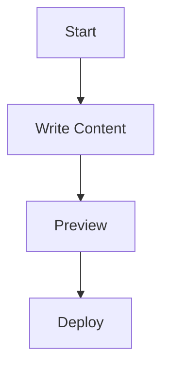

# Getting Started Guide

This is a sample guide to help you understand how to structure your content.

## Directory Structure

```
content/
├── index.md          # Home page
├── guides/           # Guides directory
│   └── getting-started.md
└── reference/        # Reference directory
    └── api.md
```

## Markdown Features

You can use all standard Markdown features plus:

### Code Blocks

```javascript
console.log('Hello, Knowledge Base!');
```

### Math (LaTeX)

$$E = mc^2$$

### Mermaid Diagrams


